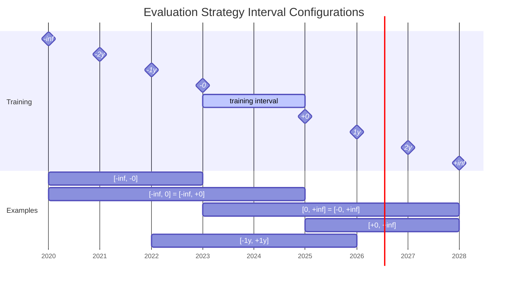

# Evaluation of models

## Configuration

To evaluate models you can configure several `EvalHandlerConfig` within the `evaluation` section of the 
pipeline configuration file.

### Evaluation Strategy

Evaluation strategies describe how the start and end intervals for evaluations are generated.

#### `_IntervalEvalStrategyConfig`

> base class used for strategies like PeriodicEvalStrategyConfig

Similar to `OffsetEvalStrategy` but allows to configure a two sided interval that defines the data used for evaluation.
`OffsetEvalStrategy` only allows offsets in one direction of the evaluation point `0`.

