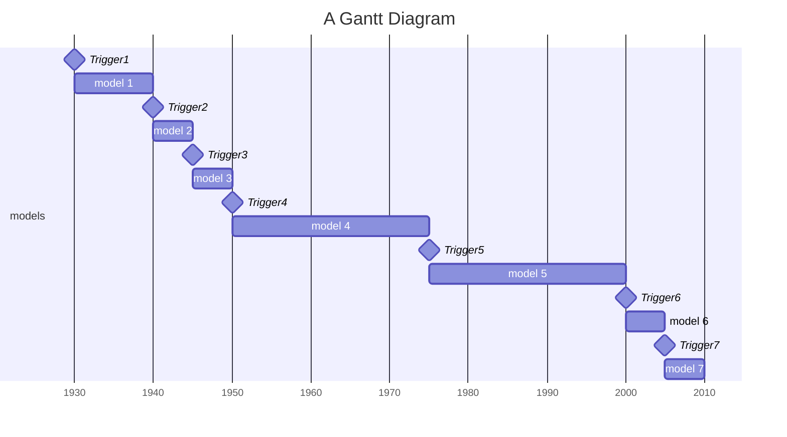
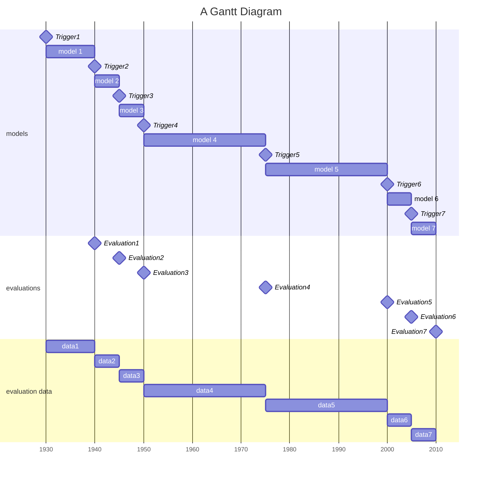

Experiment: training time vs. training batch size

# RFC: How and when to run evaluations

## Motivation

I) We want to be able to determine how well our models are performing according to some metrics like accuracy, precision, recall, F1-score, etc.

II) We also want to be able to determine how well our models are performing over time. This will allow us to determine if our models are improving, degrading, or staying the same over time.

III) We are facing two use cases that require us to run evaluations:

1) We want to run evaluations in an online fashion so we can use those evaluations for triggering policies. For example, we may want to trigger a policy that will retrain a model if the model's performance degrades below a certain threshold.

2) We want to run evaluations in an offline fashion for experiments so we determine the performance of a model **[1] at a certain point in time** as well as the **[2] total pipeline performance** aggregated over the whole time of the pipeline run (= pipeline performance).

## Setting

We are looking at a completed pipeline run that produced multiple triggers and therefore multiple models. We want to evaluate the performance of each model.

## Evaluation methodology

An evaluation methodology consists of three main components:

1) The evaluation metric (e.g. F1, accuracy, precision, recall, etc.)
2) The evaluation data (set of samples out of the evaluation split used for single model evaluation)
3) The points in time when the evaluations are run

### Use case 1: online evaluation

In this case we have to be extremely cautious to keep evaluation costs low as the are part of the trigger policy evaluation costs (or at least part of the core pipeline that cannot be disregarded like the experiment model evaluations).

During the core pipeline execution (not including experiment mode pipeline steps), we cannot access future data for evaluation. Also we don't have an evaluation split available. Therefore, we need to use the training data up to the current point in time for evaluation. This is not ideal but it is the only way to evaluate the model in an online fashion.

> The question of how far into the past we want to includes samples remains. More thought is needed before continuing on this.

### Use case 2: offline evaluation

In experiment mode we can potentially utilize the full evaluation split over the whole dataset time range. Being able to "look into the future" is important to determine the performance of a model.

#### [2] Total pipeline performance

We argue that the performance of pipeline w.r.t. a certain evaluation metric is the weighted average of the performance of the most up to date model at each point in time over the whole time range of the pipeline run.

Mind, that we need to weight every model performance at a point in time by the number of samples within that time range.

> E.g. in `model 3` from the Gantt diagram above: assuming our dataset sample distribution is so uneven that 90% of the samples are in the time range between `Trigger3` and `Trigger4`, then the performance of `model 3` should have a higher weight in the pipeline performance than the performance of `model 2`.

It can be argued that the model performance of the newest model in the time span between two triggers is well measured by the model performance (evaluation result) when evaluating with using all evaluation split samples between the two triggers.

##### State of modyn (at the time of writing)

We currectly evaluate a model directly after training it (e.g. we are now at `Trigger 4`) and have now robust approach of combining the results of the single model evaluations to a pipeline performance. We support a `OfflineEvaluationStrategy` that specifies the interval in which we want to evaluate the models. We also support `MatrixEvaluationStrategy`: We evaluate on predefined grid of evaluation points.

We face several problems:

1) We don't know when the next trigger occurs.
    This might be fine if we assume a time based trigger policy with a regular schedule where we can set the OfflineEvaluationStrategy lookahead offset to the trigger interval. However, for a generic trigger policy we cannot assume this. In consequence when setting a fixed lookahead offset we might end up evaluating a model with a lookahead offset that is too large or too small. (E.g. when always evaluate on the next 5 years after a training. That would mean that if a policy doesn't retrain for 20 years we miss a lot of data)

> After `Trigger 4` we e.g. could end up only considering the first 5 years of the time where `model 4` is used. That could completely skew the pipeline performance if e.g. as heavy drift occurs after 5 years of using `model 4`.

2) As mentioned above the individual performances of every evaluation cannot simple be averaged to get the pipeline performance as number of samples in every time range is important!

3) Without making any assumptions on how & when to trigger `MatrixEvaluationStrategy` is not of any use as the grid splits are arbitrary and don't correspond to the times when triggers occur and models are transitioned.

4) `OfflineEvaluationStrategy` is not flexible enough to handle arbitrary intervals. Even if we would run after the pipeline where we know the exact points in time when triggers occurred, we could still not specify the intervals as `OfflineEvaluationStrategy` only supports 1-sided intervals. It currently assumes being given `first_timestamp` and `last_timestamp` representing the first and last sample timestamp for the data batch that lead to the trigger. These do not correspond to the start and end time of the model usage.

>>> The ideal solution would therefore evaluate models on their entire usage period with all samples in that period.

##### Proposed solution

We add a new evaluation strategy with an according pipeline stage that runs evaluation after the rest of the core pipeline finished. By doing so we have access to all trigger times and can evaluate the models in the correct time ranges. After running evaluations on every "triggering-interval" (time between two triggers), we can calculate the pipeline performance as the weighted average of the model performances accounting for the number of samples in the time range.

> Hypothesis: There's no real need to run evaluations directly after the training. We can always do that after the core pipeline finished. If required we can also make use of information like `first_timestamp` and `last_timestamp` from the logs for a specific trigger.

#### [1] Model performance at a certain point in time

We assume the performance of a model changes continuously over time and not at discrete points in time (like the trigger times).

As we want to be able to plot the performance (i.e. accuracy) over the time range of the pipeline run, we have to observe the performance at a higher precision than [2] demands.

Plotting with evenly spaced triggering indexes as x-axis (worst case is barplot where everything between two triggers is aggregated) is not sufficient as it disregards performance change in the potentially long intervals between triggers.

Otherwise we could only plot a horizontal bar for every model evaluation at a trigger time. This would not allow us to see how the performance changes over time within one triggering interval. This information is important to fairly evaluate a trigger policy though as it could happen that a severe data drift causes rapid performance degradation. If the model wouldn't trigger for some time though we want to see that in the plot! Only plotting the total performance over the time range would hide this information.

We therefore want to evaluate the model at multiple points in time within the triggering interval. We could define a configuration option that would allow us to either set the number of evaluation steps between two triggers or the time interval or number of samples between two evaluations.

As we use the same model within a triggering interval, inference results would change within this time frame when evaluating twice. Therefore we could just run the inference once then compute the "local accuracy" around a certain evaluation point.

> Open question: As I'm currently unaware how much of the evaluation we compute ourself or delegate to pytorch/tensorflow, I'm not sure if reusing inference results would be possible and practical. And alternative is to run the inference twice on samples that are in the "circumference" of multiple evaluation points. Performance here isn't a concern as this is time that is not part of the core pipeline.

Theoretically it would be possible to partition the evaluation split of one "triggering interval" into multiple evaluation splits for every evaluation point. This would allow us to evaluate the model at every evaluation point with the same samples. The advantage of this is that we could combine these single results to a total performance over the whole triggering interval. The same problems as in [2] would apply though (e.g. weighting of the results). Therefore I suggest treating the two evaluation types separately (also cleaner in code).

> Remark: We would need new evaluation strategies for this as we need intervals with custom bounds on both sides.

