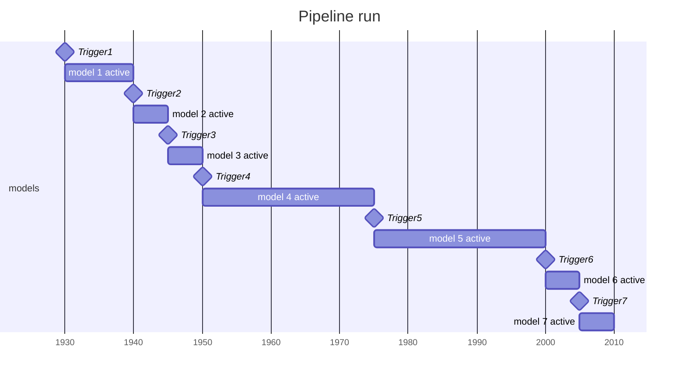
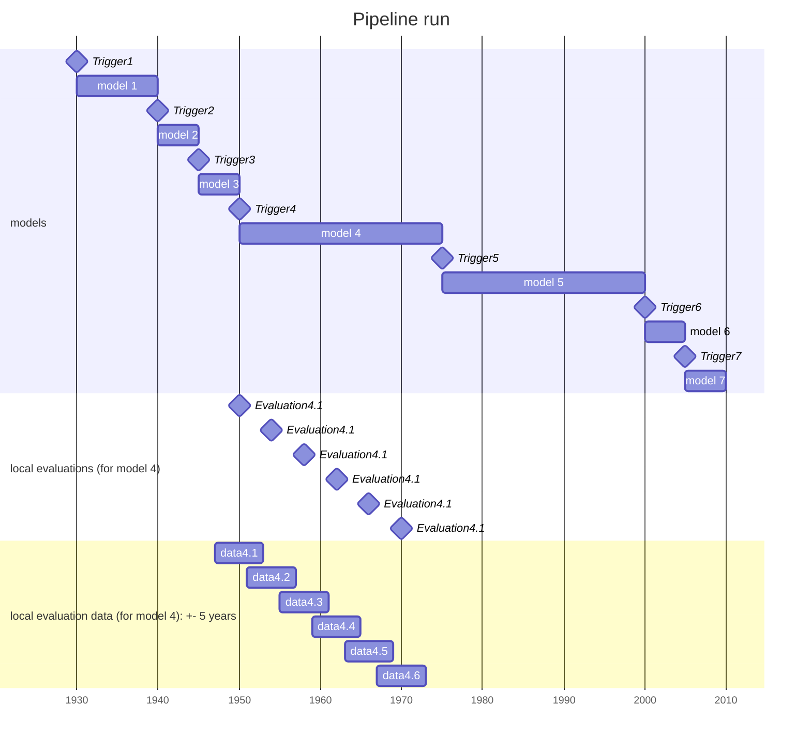
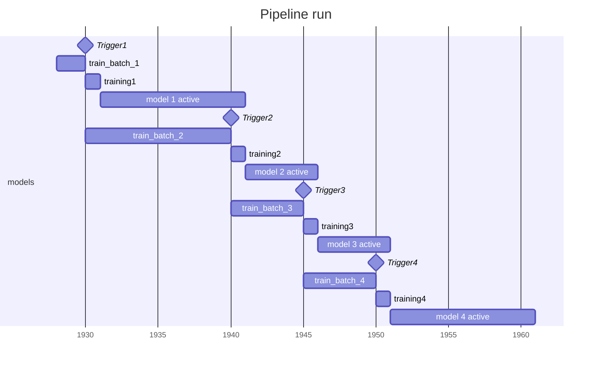
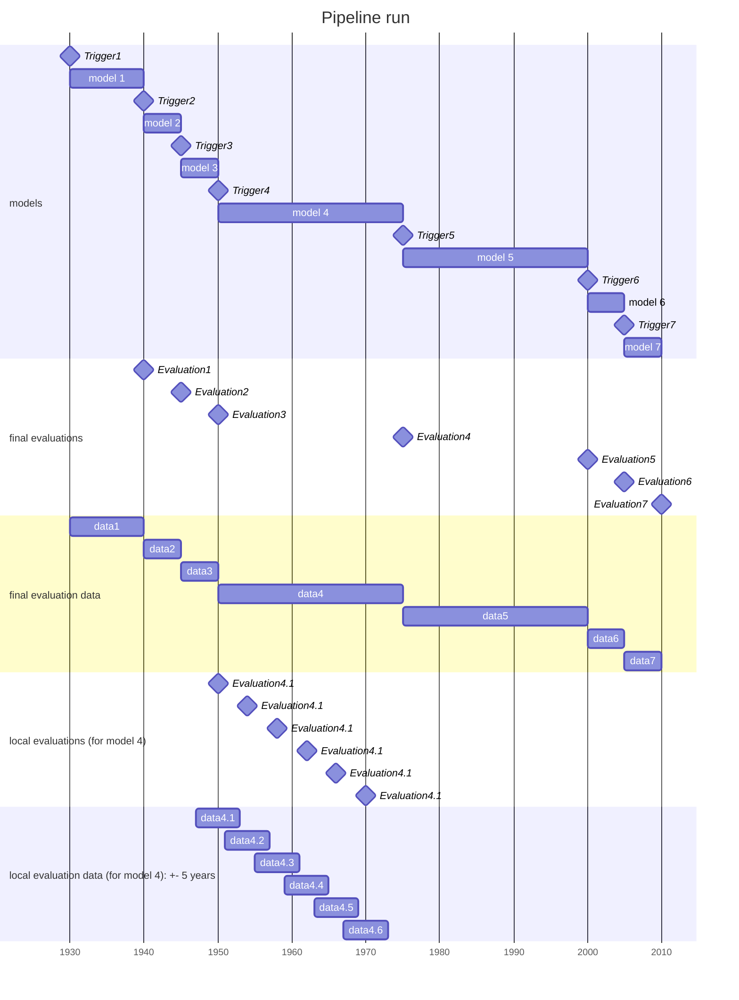

# RFC: Evaluation use cases and when & how to apply them

## 1. Motivation

### 1.1 Use cases

We want to be able to:

1) determine how well our models are performing according to some metrics like accuracy, precision, recall, F1-score, etc.

2) determine how well our models are performing over time. This will allow us to determine if our models are improving, degrading, or staying the same over time.

3) analyze and compare entire pipeline runs (and not only the different models created over one pipeline run)

We are facing two use cases that require us to run evaluations:

1) **Online evaluations**: We want to run evaluations during the execution of the core pipeline so we can feed back this information into performance-aware triggering policies. For example, we may want to trigger a policy that will retrain a model if the model's performance degrades below a certain threshold.

2) **Post-hoc offline analysis**: We want to run evaluations for experiments so we determine the performance of a model **at a certain point in time (3.2.1)** over the course of a whole pipeline run (also for intervals where it has long been replaced with a newer model). Orthogonally to this  we are interested in the **total pipeline performance (3.2.2)** aggregated over the whole time of the pipeline run (= pipeline performance). For this we are only interested in the freshest model at each point in time as this is the model that a production system would use for inference queries.

## 2. Background

### 2.1 Setting

To visualize the different evaluation concepts and strategies, let's consider a completed pipeline run that produced multiple triggers and therefore multiple models. We want to evaluate the performance of each model on a set of evaluation metrics (accuracy, F1, ...).

> TODO: visualize that we use a set of evaluation metrics

### 2.3 Evaluation methods

One evaluation method consists of three main aspects:

1) A set of evaluation metrics (e.g. F1, accuracy, precision, recall, etc.)
2) The points in time when the evaluations are run
3) The evaluation data for the different evaluation triggers (set of samples that are used for an evaluation). Note that this data can be in form of pre-determined dataset slices, or dynamically determined based on the e.g. time time of evaluation (e.g. interval around the evaluation time).

## 3. Implementation

### 3.1 Online evaluations

#### Runtime considerations

In this case we have to account for the time we spend evaluating as it can be considered part of the core pipeline. Evaluation costs can e.g. be modeled as parts of the trigger policy evaluation costs - or at least part of the core pipeline that cannot be disregarded like the Post-hoc offline analysis (for experiment mode).

During the core pipeline execution, we cannot access future data for evaluation as a production system also wouldn't be able to do that. It might make sense to allow modyn to build a holdout dataset that is isn't used for training but only for evaluations. A simplifying assumption would be to only evaluate on new data since the last training run that has not been seen by the training server. (Let's try that first?)

> We haven't put much though into what samples should be taken into account (i.e. how far into the past samples should be taken from)

### 3.2 Post-hoc offline analysis

In experiment mode we can potentially utilize the full evaluation split over the whole dataset time range. Being able to "look ahead" is important to determine the performance of a model post factum as the usage period of model is after the training.

#### Which dimensions are there? (controllable & observable)

Naturally when running a pipeline we can a observe $m$ models being trained over time at the triggers $t_i \in T$. We refer to $m_i$ as the ith model trained after trigger $t_i$.

Every of these $m$ models can be evaluated at any point in time (bounded by the dataset time range). As we are potentially interested in more than one evaluation metric $q_i \in Q$ ($Q$ being the set of evaluation metrics that are of interest to us), we can evaluate every model at every point in time with every evaluation metric. We therefore get a time series of evaluation results for combination in $M \times Q$.

#### 3.2.1 Analysis of a single pipeline run (comparing the different models)

  
<b>Plot 1: (line plot, x=time, y=eval metric, color=model)
</b>

When analyzing how a single pipeline run performed over time, we can line-plot the evaluation results over time using time as the $x$ dimension, the evaluation metric as the $y$ dimension and the model as a color coded dimension. If using the same plot for all evaluation metrics overloads the plot, we can do one plot per evaluation metric.

Using this plot we expect to see that every model performs best at the interval it was trained (and intended to be served in). Accuracy should decay in both directions from the training interval.

There are two main approaches to acquire those time series of evaluation results:

##### Dataset slicing (`MatrixEvaluationStrategy`)

Partitioning the dataset(s) w.r.t. to time at sufficiently small intervals will allow us to extract a time series after running evaluations for every (slice, model, metric) combination.

When plotting this there are several cases:

- When our slices already correspond to the minimal resolution of the samples times (e.g. every year), we don't need to think about interpolation and can just connect the measurement points with lines.

- When we have more continuous data where we cannot evaluate at every point in time, can either plot vertical lines (same value for a certain time range) or interpolate. In the latter case it's fair to plot the points for each evaluation interval at the interval center and connect the points with lines (linear interpolation).

##### Rolling windows (new)

(centered around points in time where we intend to query evaluation metrics)

We want to address the problem of not being able to capture the full time resolution of the dataset when slicing it into partitions. We cannot shrink the slices arbitrarily as this would decrease the number of samples in every evaluation split and therefore the reliability of the evaluation results.

We can therefore use rolling windows that theoretically allow to assign evaluation metrics to every step in time. This is enabled by the fact that the intervals used for evaluation can overlap here. We can therefore evaluate the model at every point with slightly shifted evaluation data. We definitely don't need to do this at sample level in our use cases but it gives us more flexibility in how we want to evaluate the models.

#### 3.2.2 Comparison of a multiple pipeline runs (comparing the different models)

When we are not looking at a single pipeline run but at multiple pipeline runs, we gain another dimension that marks the pipeline run.
Consequently, we are dealing with the following dimensions:

- time
- evaluation metric (categorical)
- evaluation metric value
- model
- pipeline run

From now on we will assume the different categorical evaluation metrics will be plotted in different plots, so we consider this dimension fixed now.

What is more, the model dimension is not of any interest anymore here, as we compare at pipeline run level.

That leaves us with the following dimensions: time, evaluation metric value, pipeline run. However, we don't have a unified time series of evaluation results available just jet for the whole pipeline (only on model level). It can be argued that the pipeline performance at time $t$ is the performance of the most up to date model at time $t$. At pipeline level, we do e.g. not care anymore, how an outdated and stale model form the pipeline start performs at the end of the pipeline - it wouldn't be used for inference. Through **post-processing** we can stich the curves of the different models together to get a pipeline performance curve. By doing so we create a unified time series of evaluation results for the whole pipeline run that 
always uses the newest model.

> Note: when considering the pipeline as an **ensemble model** of the different models, we can highlight this curve in plot 1 above.

  
<b>Plot 2: (line plot, x=time, y=eval metric (ensemble of all models), color=pipeline)</b>

With that time series per pipeline run, we can already plot the pipelines performance over time for several pipeline runs. We can color code the pipelines to distinguish them.

We expect to see spikes in the pipeline performances when a new model is trained and a stale model is replaced. For pipelines with different
trigger policies we expect to see different patterns in the pipeline performance (as retraining takes place at different points in time).

An interesting realization is that when comparing arbitrary different trigger policy pipelines, we cannot rely on equidistant triggering timestamps, as different pipeline runs could have evaluations centered around different points in time (currently evaluations are done after training). The MatrixEvaluationStrategy partially addresses this but the rolling window approach feels more natural here.

Evaluation at regular intervals would look sth like this:

  
<b>Plot 4 (matrix plot, x=time up to which samples where used for training, y=model (categorical), color=accuracy of model at this point)</b>

Similar to already existing plots from `MatrixEvaluationStrategy`, but with a different x-axis, not using the triggers as the x-axis discretization,
but the time up to which samples were used for training. We can use use the rolling window approach described above.

Compared to the current approach this diagram integrates a fair representation of "time" (x-axis). As triggers aren't spaced equally in an abstract trigger policy the current assumptions don't hold anymore. Also this brings the advantage that we would see how drift / model degradation accumulates over **realtime** (not trigger indexes).

##### 3.2.2.1 Total pipeline performance

The next will start considering not only the performance of a pipeline, but also the cost of running the pipeline - which is mainly
made up of training costs, policy evaluation costs and data loading costs.

Contiouing from the previous section, we are left  with the following dimensions:

- time
- evaluation metric value
- pipeline run
- cost

For a cost/performance tradeoff comparison there are two usefull plotting strategies:

  
<b>Plot 2 + Plot 3 (stacked barplot, x=time, y=cost | eval metric value (ensemble of all models), color=pipeline)</b>

When plotting the cost (cumulative/non-cumulative) over time using the same x-axis scale as the performance plot, we can compare the cost and performance of the different pipelines. We just have to align the plots under each other.

    
<b>Plot 5 (scatterplot, x=total cost (aggregated over time), y=total cost per pipeline run (aggregated over time), color=pipeline)</b>

    
    To unify both dimensions (cost and performance) into one plot, we can plot the total cost of a pipeline run against the total performance of a pipeline run. This allows us to compare the cost/performance tradeoff of different pipelines.

    When a user has decided how much he is willing to sacrifice in training time to get rid of a certain amount of performance degradation, this ratio can be visualized in this plot as a straight line that cuts through origin. Policies below this line are not desirable as they overspend. The steeper gradient $y(y) / x(p)$ of a point in the plot, the more efficient the pipeline run is in terms of cost/performance tradeoff. The question remains how we acquire the total (aggregated) performance of a pipeline w.r.t. to a fixed evaluation metric.

##### 3.2.2.2 Aggregated pipeline performance

As mentioned for plot 5, we need a scalar metric capturing the total performance of a pipeline run. We can define this as the weighted average of the performance of the most up to date model at each point in time over the whole time range of the pipeline run. Rather than using the number of samples as weights (performance should be independent of the actual number of inference queries we get) we use the time the duration where a model was served for inference.

Let's visualize this in the Gantt diagram from 2.1 above:

> E.g. Assume there was no `Trigger5`. Then we should have a really long period where model 4 is used. It becomes clear very fast, that this model has a higher impact on the total aggregated pipeline performance than the a model that was only used for a short period of time (e.g. 1 year).

#### 3.2.3 Refined pipeline run model

Accounting for the afore mentioned assumptions that training takes some time, we can visualize a pipeline run as follows:

The difference to our simplified model earlier is that we not assume `training_time=0` anymore and therefore cannot ignore `training_<i>` .

> **Remark/Assumptions**: It can be argued though that evaluating one model on the data between two triggers still gives us a good estimate. They are not exactly the same, as we would still use the old model while a training is going on (see diagram below). However, we claim that the difference is negligible as (1) we don't expect much drift between the samples directly after the trigger and after the training (close in time). And (2) compared to the time between two triggers (often years in our case), the duration of a training process is rather small and therefore doesn't have a big impact on the evaluation.

## 3. State of modyn (at the time of writing)

We currectly evaluate a model directly after training it (e.g. we are now at `Trigger 4`) and have now robust approach of combining the results of the single model evaluations to a pipeline performance. We support a `OffsetEvaluationStrategy` that specifies the interval in which we want to evaluate the models. We also support `MatrixEvaluationStrategy` where we evaluate on a predefined grid of evaluation points.

We face several problems:

1) We don't know when the next trigger occurs.
    This might be fine if we assume a time based trigger policy with a regular schedule where we can set the OffsetEvaluationStrategy lookahead offset to the trigger interval. However, for a generic trigger policy we cannot assume this. In consequence when setting a fixed lookahead offset we might end up evaluating a model with a lookahead offset that is too large or too small. (E.g. when always evaluate on the next 5 years after a training. That would mean that if a policy doesn't retrain for 20 years we miss a lot of data)

> After `Trigger 4` we e.g. could end up only considering the first 5 years of the time where `model 4` is used. That could completely skew the pipeline performance if e.g. as heavy drift occurs after 5 years of using `model 4`.

2) Without making any assumptions on how & when to trigger `MatrixEvaluationStrategy` is not particularly useful as the grid splits are arbitrary and don't correspond to the times when triggers occur and models are transitioned.

3) `OffsetEvaluationStrategy` is not flexible enough to handle arbitrary intervals. Even if we would run after the pipeline where we know the exact points in time when triggers occurred, we could still not specify the intervals as `OffsetEvaluationStrategy` only supports 1-sided intervals. It currently assumes being given `first_timestamp` and `last_timestamp` representing the first and last sample timestamp for the data batch that lead to the trigger. These do not correspond to the start and end time of the model usage.

4) Plotting with evenly spaced triggering indexes as x-axis (worst case is barplot where everything between two triggers is aggregated) is not sufficient as it disregards performance change in the potentially long intervals between triggers. Otherwise we could only plot a horizontal bar for every model evaluation at a trigger time. This would not allow us to see how the performance changes over time within one triggering interval. This information is important to fairly evaluate a trigger policy though as it could happen that a severe data drift causes rapid performance degradation. If the model wouldn't trigger for some time though we want to see that in the plot! Only plotting the total performance over the time range would hide this information.

>>> The ideal solution would therefore evaluate models on their entire usage period with all samples in that period.

##### Proposed solution

We add a new evaluation strategy with an according pipeline stage that runs evaluation after the rest of the core pipeline finished. By doing so we have access to all trigger times and can evaluate the models in the correct time ranges. After running evaluations on every "triggering-interval" (time between two triggers), we can calculate the pipeline performance as the weighted average of the model performances accounting for the number of samples in the time range.

> Generally, there's no real need apart from early debugging feedback to run evaluations directly after the training. We can always do that after the core pipeline finished. If required we can also make use of information like `first_timestamp` and `last_timestamp` from the logs for a specific trigger.

### Open Question

1) With the approach of evaluating a model only on future data (where the model is eventually used), it might even be fair not to use a evaluation split as the samples used for evaluation are never part of the training data of a particular model. Agreed?

2) What behavior do we desire when we train multiple models on the same timestamp (e.g. if we have a lot of data at a certain point in time). One option for plotting would be to weight average the different according to how many samples of this point in time were covered by the respective model. Considering the samples that are used to evaluate the models we cannot different the evaluation data of two training runs on the same timestamps (even if their batches might contain different samples)

## TODO

- plot / experiment: training time vs. training batch size
