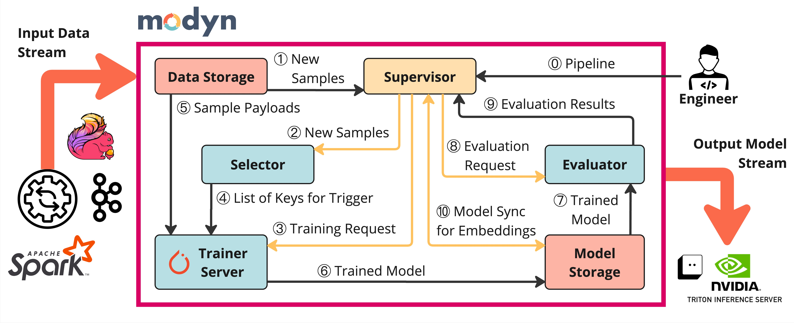

# Modyn's Architecture

---

## Basic Data Flow

Modyn consists of several components that implement different functionality.
When running a pipeline, data samples stream in from outside Modyn into the data storage component, which assigns a key to each sample that is used to uniquely identify it.
Data storage informs the supervisor about new samples by their key ①.
The supervisor checks for triggers and forwards potential triggers and the sample keys to the selector ②.
Upon trigger, the supervisor contacts the trainer server to start a training process ③.
The trainer requests the trigger training set from the selector ④, and the sample data from the storage ⑤.
The trainer then runs a training according to the configuration ⑥.
The trained model, the output of \modyn, can then be used in further steps in the overall ML workflow, such as deployment ⑦.
Note that we are actively developing this architecture - for example, a new model storage component is in the works to alleviate the Supervisor of managing the trained models.

Information on pipelines can be found in the [EXAMPLE.md](EXAMPLE.md).
Information on how to extend Modyn with new policies and how to develop the codebase can be found in the [TECHNICAL.md](TECHNICAL.md).

## Production vs Experiment Mode

We can execute pipelines in either _experiment mode_ or _production mode_.
In production mode, the data storage informs the supervisor when new data points come in.
In experiment mode, the data storage simulates new data points streaming in by announcing already existing data points as _new_ to the supervisor.

The experiment mode can be used to play various traces and compare how policies do given the same data environment and initial model config.
The insights gained from these experiments can then be used to find a configuration for production mode.

## Component Overview

### Supervisor

The supervisor is the brain of a pipeline as it coordinates the control and data flow.
It registers a new pipeline at all components.
The supervisor receives the keys of new samples from storage, and forwards them to the selector.
On the x-th trigger, it notifies the trainer server to train on the trigger training set.
The supervisor implements additional coordination mechanisms, such as supplying the model from the previous trigger to the trainer server.

In addition to coordinating pipeline execution, the supervisor implements triggering policies.
We identify three types of triggers: (i) amount-based, (ii) time-based, and (iii) drift-based triggers.
Amount-based triggers fire every n data points, while time-based triggers fire after a time interval has passed.
Drift-based triggers are based on detection of distribution shifts, either in the input data distribution or the model output distribution (i.e., the performance of the deployed model).
They are more adaptive to the data stream than amount- and time-based triggers.
We currently support time and amount-based triggers and plan to add support for drift-based triggers.
Output-drift triggers require connecting \modyn{} to the inference pipeline, which Modyn does not currently support.

### Selector

The selector implements data selection policies that, on trigger, output the trigger training set.
We differentiate between online and offline selection policies.
Offline policies are policies that calculate the trigger training set on trigger by collecting all samples and running calculations on potentially all previous data points.
Common examples of such policies include coreset algorithms.
While the term coreset can be generally used to describe any data reduction technique, the approach has primarily been applied to static datasets.
The pluggable selector interface aims to enable ML researchers to implement and compare such policies, as well as develop their own policies to optimize model accuracy, training time, energy, and cost.
Data selection strategies can be used with or without _reset_ of the internal strategy state after a trigger, e.g., the strategy that outputs all seen datapoints can be used both for retraining from scratch (no reset) or finetuning the previous model (reset).

### Trainer Server

Compatibility with existing ML infrastructure is one of our design principles.
The trainer server implements a generic training interface that runs a model training job based on a pipeline definition.
Our prototype currently implements a PyTorch-based trainer, however, the design is agnostic to the ML framework and can be extended to Tensorflow or higher level abstractions, such as SageMaker.
The trainer server executes a training loop, which consists of steps, such as model initialization, setup of optimizer(s), and handling registered callbacks (e.g., for metadata collection).
The trainer fetches data from the storage layer and interacts with the selector via an [OnlineDataset](modyn/trainer_server/internal/dataset/online_dataset.py) abstraction.

### Data Storage

Modyn pipelines ingests files from data sources such as stream processing or ETL jobs.
The data storage component abstracts different file formats and file systems (e.g., local file system or remote storage services like S3).
Each file can contain one or more samples, which can be of any form, e.g., entire files, database rows, etc.
The goal of Modyn's storage abstraction is to decouple the trainer from the underlying data representation and to minimize the amount of data transferred.

### Metadata Processor

The metadata processor is responsible for transforming collected metadata (e.g., compressing gradients) and persisting it to Modyn's metadata database.
While we currently collect and store metadata per training sample, the optimal granularity for metadata collection and storage to balance storage costs, query latencies, and the effectiveness of data selection and triggering policies remains an open question.
