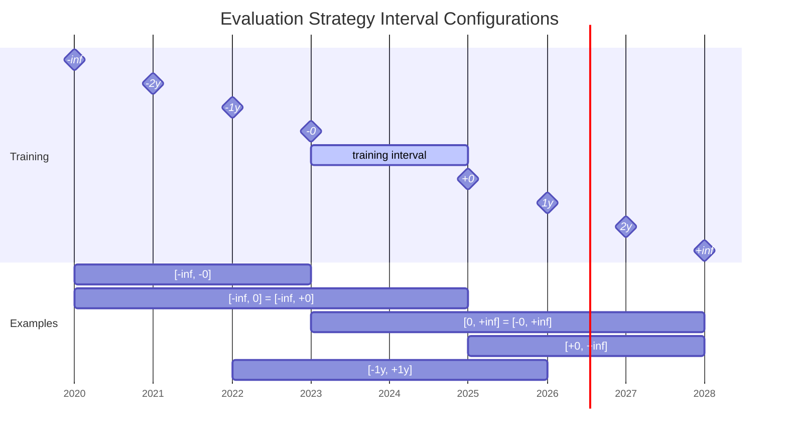

# Evaluation of models

## Configuration

To evaluate models you can configure several `EvalHandlerConfig` within the `evaluation` section of the 
pipeline configuration file.

There are two main configuration elements:

- evaluation trigger time: Configures when an evaluation should be triggered.
- evaluation strategy: This determines which data should be used for evaluation.

### Evaluation Trigger Time

We support periodic (by sample count or time), static (pre-configured) and AfterEveryTrainingEvalTriggerConfig.

### Evaluation Strategy

#### `IntervalEvalStrategyConfig`

Allows to configure a two sided interval that defines the data used for evaluation.

