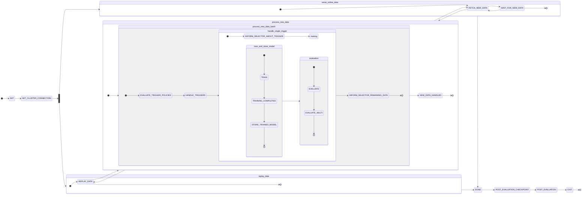

# Pipeline

## Pipeline Orchestration

### Current pipeline

```mermaid
stateDiagram-v2
    direction LR
    [*] --> INIT
    INIT --> INIT_CLUSTER_CONNECTION
    state fork_state <<fork>>
        INIT_CLUSTER_CONNECTION --> fork_state
        fork_state --> replay_data
        fork_state --> serve_online_data
        state replay_data {
            [*] --> REPLAY_DATA
            REPLAY_DATA --> [*]
        }
        REPLAY_DATA --> process_new_data
        process_new_data --> REPLAY_DATA
        state serve_online_data {
            [*] --> FETCH_NEW_DATA
            FETCH_NEW_DATA --> WAIT_FOR_NEW_DATA
            WAIT_FOR_NEW_DATA --> FETCH_NEW_DATA
            WAIT_FOR_NEW_DATA --> [*]
        }
    replay_data --> DONE
    serve_online_data --> DONE
    state process_new_data {
        direction LR
        state process_new_data_batch {
            direction LR
            [*] --> EVALUATE_TRIGGER_POLICIES
            EVALUATE_TRIGGER_POLICIES --> HANDLE_TRIGGERS
            state handle_single_trigger {
            direction LR
                [*] --> INFORM_SELECTOR_ABOUT_TRIGGER
                INFORM_SELECTOR_ABOUT_TRIGGER --> training
                state train_and_store_model {
                    [*] --> TRAIN
                    TRAIN --> TRAINING_COMPLETED
                    TRAINING_COMPLETED --> STORE_TRAINED_MODEL
                    STORE_TRAINED_MODEL --> [*]
                }
                state evaluation {
                    [*] --> EVALUATE
                    EVALUATE --> EVALUATE_MULTI
                    EVALUATE_MULTI -->  [*]
                }
                train_and_store_model --> evaluation
            }
            HANDLE_TRIGGERS --> handle_single_trigger
            handle_single_trigger --> INFORM_SELECTOR_REMAINING_DATA

            INFORM_SELECTOR_REMAINING_DATA --> [*]
        }
        [*] --> process_new_data_batch
        process_new_data_batch --> NEW_DATA_HANDLED
        NEW_DATA_HANDLED --> [*]
    }
    FETCH_NEW_DATA --> process_new_data
    process_new_data --> FETCH_NEW_DATA
    DONE --> POST_EVALUATION_CHECKPOINT
    POST_EVALUATION_CHECKPOINT --> POST_EVALUATION
    POST_EVALUATION --> EXIT
    EXIT --> [*]
```
