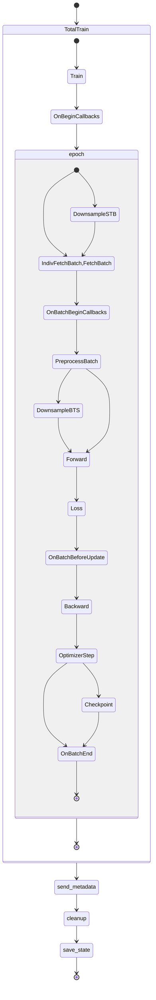

```mermaid
stateDiagram-v2
    [*] --> TotalTrain

    state TotalTrain {
        [*] --> Train
        Train --> OnBeginCallbacks
        OnBeginCallbacks --> epoch

        state epoch {
            [*] --> DownsampleSTB
            [*] -->  IndivFetchBatch,FetchBatch
            DownsampleSTB --> IndivFetchBatch,FetchBatch
            IndivFetchBatch,FetchBatch -->  OnBatchBeginCallbacks
            OnBatchBeginCallbacks --> PreprocessBatch
            PreprocessBatch --> DownsampleBTS
            DownsampleBTS --> Forward
            PreprocessBatch --> Forward
            Forward --> Loss
            Loss --> OnBatchBeforeUpdate
            OnBatchBeforeUpdate --> Backward
            Backward --> OptimizerStep
            OptimizerStep --> Checkpoint
            OptimizerStep --> OnBatchEnd
            Checkpoint --> OnBatchEnd
            OnBatchEnd --> [*]
        }
        epoch --> [*]
    }
    TotalTrain --> send_metadata
    send_metadata --> cleanup
    cleanup --> save_state
    save_state --> [*]

```
