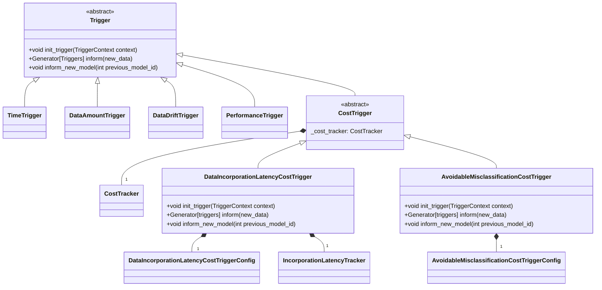
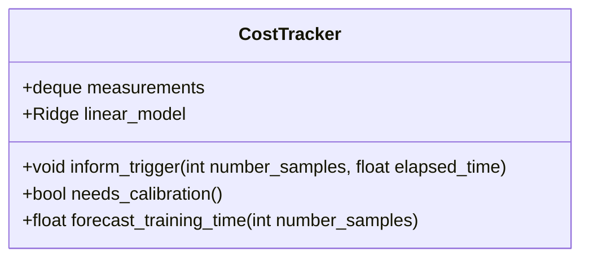
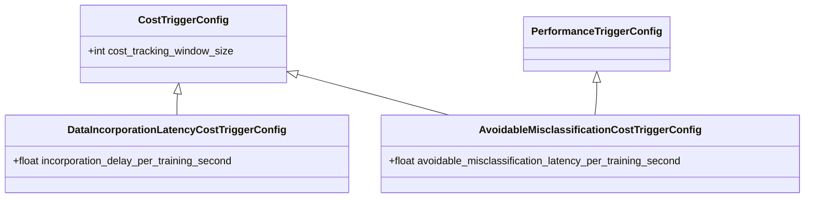

# Cost-Based Triggering

## Overview

Cost-based triggers evaluate the trade-off between the cost of triggering (e.g., training time) and the benefits gained from triggering (e.g., reducing regret metrics like data incorporation latency or avoidable misclassification latency). The `CostTrigger` class serves as the base class for specific implementations, such as `DataIncorporationLatencyCostTrigger` and `AvoidableMisclassificationCostTrigger`, which utilize different regret metrics.

### Main Architecture

<!-- TODO: Add performance tracking details to AvoidableMisclassificationCostTrigger -->

### `CostTrigger` Hierarchy

Both `DataIncorporationLatencyCostTrigger` and `AvoidableMisclassificationCostTrigger` track the cost of triggering and convert a regret metric (e.g., data incorporation latency or avoidable misclassification latency) into the training time unit with a user-defined conversion factor.

<b>Incorporation Latency</b>

Incorporation latency measures the delay in integrating / addressing new data or drift problems. They are typically set up as a area-under-the-curve metric, where the area is the time taken to incorporate the data. The underlying curve function is the number of samples or problems over time that need to be addressed.

#### `DataIncorporationLatencyCostTrigger`

- Uses data incorporation latency as the regret metric
- Measures the delay in integrating new data
- Triggers when the accumulated integration delay converted to time units (user defined conversion factor) exceed the expected training time

#### `AvoidableMisclassificationCostTrigger`

- Extends performance-aware triggers with a cost-awareness aspect
- Uses avoidable misclassification latency as the regret metric
- Triggers when the accumulated misclassification latency (in training time units) exceeds the expected training time.

### `CostTracker`

- **Purpose**: Tracks and forecasts the cost of triggers (e.g., wall clock time) based on past trigger data.
- **Functionality**:
  - Records the number of samples processed and the time taken for each trigger.
  - Uses a linear regression model to forecast future training times based on the number of samples.
  - Requires calibration after each trigger to refine its predictions.

<!-- TODO: add incorporation latency tracker -->

### `CostTriggerConfig`

