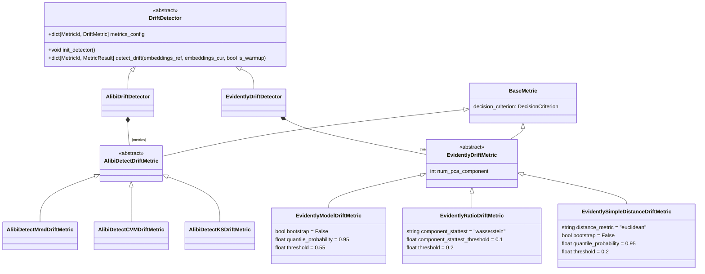

# Drift Triggering

## Overview

As can be seen in [TRIGGERING.md](../TRIGGERING.md) the `DataDriftTrigger` follows the same interface as the simple triggers. The main difference is that the `DataDriftTrigger` is a complex trigger that requires more information to be provided to the trigger.

It utilizes `DetectionWindows` to select samples for drift detection and `DriftDetector` to measure distance between the current and reference data distributions. The `DriftDecisionPolicy` is used to generate a binary decision based on the distance metric using a specific criterion like a threshold or dynamic threshold. Hypothesis testing can also be used to come to a decision, however, we found this to be oversensitive and not very useful in practice.

### Main Architecture

### DetectionWindows Hierarchy

The `DetectionWindows` class serves as the abstract base for specific windowing strategies like `AmountDetectionWindows` and `TimeDetectionWindows`. These classes are responsible for both storing the actual data windows for reference and current data and for defining a strategy for updating and managing these windows.

### DriftDetector Hierarchy

The `DriftDetector` class is an abstract base class for detectors like `AlibiDriftDetector` and `EvidentlyDriftDetector`, which use different metrics to measure the distance between the current and reference data distributions. It generates distance values.

The `BaseMetric` class hierarchy is a series of Pydantic configuration classes while the `Detectors` are actual business logic classes that implement the distance calculation.

### DecisionCriterion Hierarchy

The `DecisionCriterion` class is an abstract configuration base class for criteria like `ThresholdDecisionCriterion` and `DynamicThresholdCriterion`, which define how decisions are made based on drift metrics.

### DriftDecisionPolicy Hierarchy

The `DriftDecisionPolicy` class is an abstract base class for policies like `ThresholdDecisionPolicy`, `DynamicDecisionPolicy`, and `HypothesisTestDecisionPolicy`.

Each Decision policy wraps one DriftMetric (e.g. MMD, CVM, KS) and one DecisionCriterion (e.g. Threshold, DynamicThreshold, HypothesisTest) to make a decision based on the distance metric. It e.g. observes the series of distance value measurements from it's `DriftMetric` and makes a decision after having calibrated on the seen distances.

Within one `DataDriftTrigger` the different results from different `DriftMetrics`'s `DriftDecisionPolicies` can be aggregated to a final decision using a voting mechanism (see `DataDriftTriggerConfig.aggregation_strategy`).

This architecture provides a flexible framework for implementing various types of data drift detection mechanisms, different detection libraries, each with its own specific configuration, detection strategy, and decision-making criteria.
