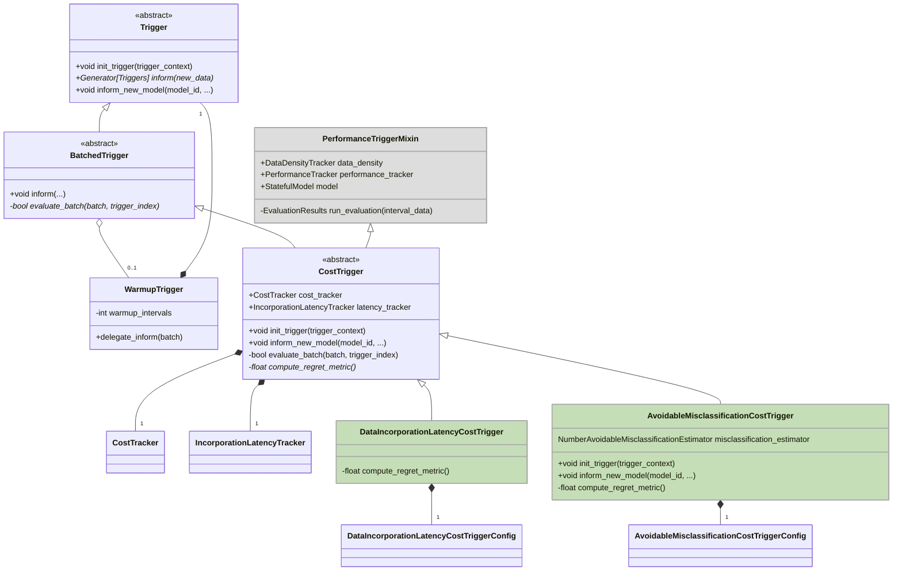
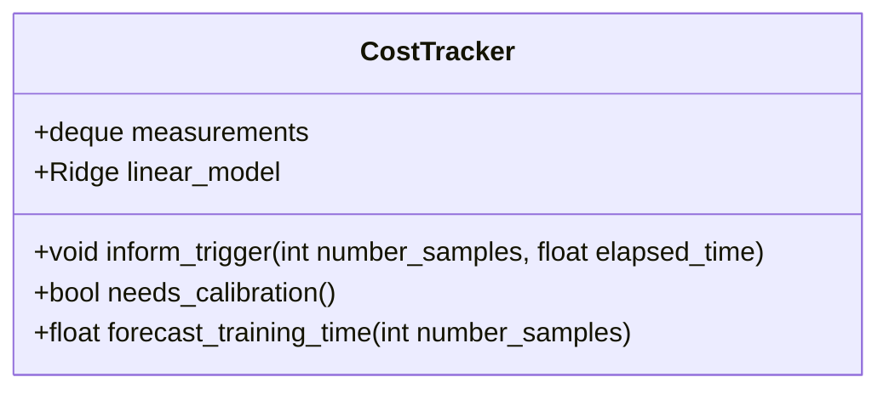
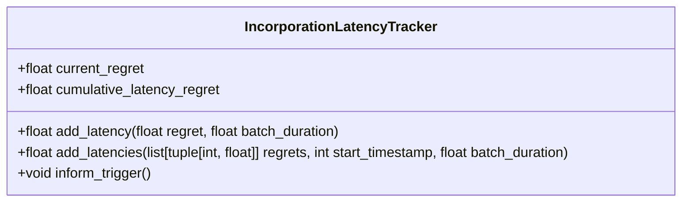
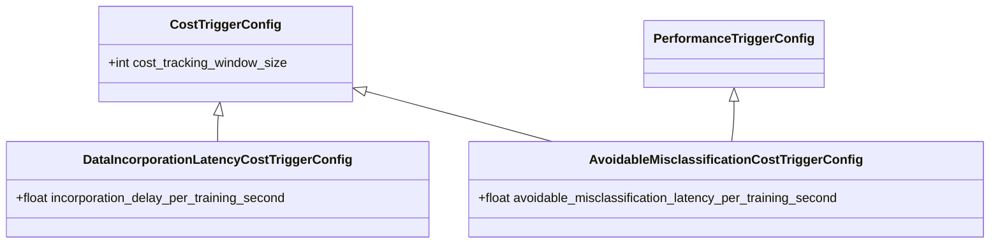

# Cost-Based Triggering

## Overview

Cost-based triggers evaluate the trade-off between the cost of triggering (e.g., training time) and the benefits gained from triggering (e.g., reducing regret metrics like data incorporation latency or avoidable misclassification latency).

As regret, we define metrics that quantify the negative impact of not addressing a problem in a timely manner. They
therefore help in decision making processes like scheduling or retraining decisions.
In the context of `modyn` triggering, we can view regret based metrics as the cost of not triggering.

The `CostTrigger` class serves as the base class for specific implementations, such as `DataIncorporationLatencyCostTrigger` and `AvoidableMisclassificationCostTrigger`, which utilize different regret metrics.

While no trigger occurs regret units are cumulated into to a regret over time curve.
Rather than using this regret units directly, we build an area-under-the-curve metric.
The area under the regret curve measures the time regret units have spent being unaddressed.

As this policy operates the two metrics `time` (cost) and a regret metric we need
a way to express the tradeoff between the two. A user e.g. has to specify how many seconds of training time he is
willing to eradicate a certain amount of cumulative regret.

### Main Architecture

### `CostTrigger` Hierarchy

Both `DataIncorporationLatencyCostTrigger` and `AvoidableMisclassificationCostTrigger` track the cost of triggering and convert a regret metric (e.g., data incorporation latency or avoidable misclassification latency) into the training time unit with a user-defined conversion factor.

<b>Incorporation Latency</b>

Incorporation latency measures the delay in integrating / addressing new data or drift problems. They are typically set up as a area-under-the-curve metric, where the area is the time taken to incorporate the data. The underlying curve function is the number of samples or regret units over time that need to be addressed.

#### `DataIncorporationLatencyCostTrigger`

- Uses data incorporation latency as the regret metric
- Measures the delay in integrating new data
- Triggers when the accumulated integration delay converted to time units (user defined conversion factor) exceed the expected training time

#### `AvoidableMisclassificationCostTrigger`

- Extends performance-aware triggers with a cost-awareness aspect
- Uses avoidable misclassification latency as the regret metric
- Triggers when the accumulated misclassification latency (in training time units) exceeds the expected training time.

### `CostTracker`

- **Purpose**: Tracks and forecasts the cost of triggers (e.g., wall clock time) based on past trigger data.
- **Functionality**:
  - Records the number of samples processed and the time taken for each trigger.
  - Uses a linear regression model to forecast future training times based on the number of samples.
  - Requires calibration after each trigger to refine its predictions.

### `IncorporationLatencyTracker`

- **Purpose**: Tracks latency-based regret metrics like data-incorporation-latency.
- **Functionality**:
  - Stores how many units of regret have been seen so far, and their latency.
  - The regret latency measures the number of seconds regret units have spent being unaddressed by a trigger.
  - When modeling a regret over time curve, the current regret is value of the curve at the current time.
  - The cumulative latency regret is the area under the curve up to the current time.

### `CostTriggerConfig`

