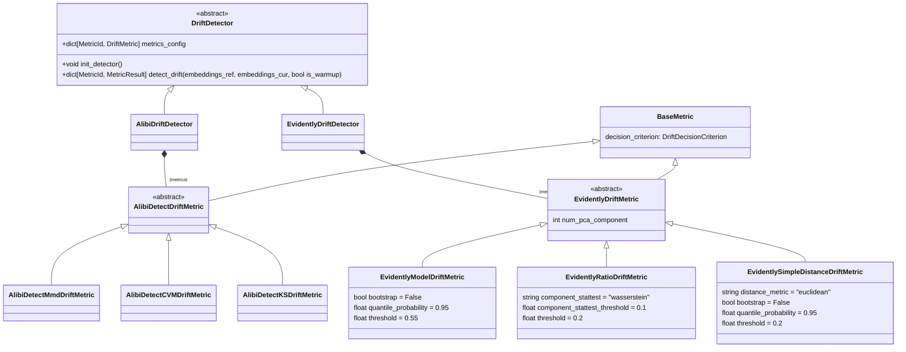

# Drift Triggering

## Overview

As can be seen in [TRIGGERING.md](../TRIGGERING.md) the `DataDriftTrigger` follows the same interface as the simple triggers. The main difference is that the `DataDriftTrigger` is a complex trigger that requires more information to be provided to the trigger.

It utilizes `DetectionWindows` to select samples for drift detection and `DriftDetector` to measure distance between the current and reference data distributions. The `DriftDecisionPolicy` is used to generate a binary decision based on the distance metric using a specific criterion like a threshold or dynamic threshold. Hypothesis testing can also be used to come to a decision, however, we found this to be oversensitive and not very useful in practice.

### Main Architecture

### `DetectionWindows` Hierarchy

The `DetectionWindows` class serves as the abstract base for specific windowing strategies like `AmountDetectionWindows` and `TimeDetectionWindows`. These classes are responsible for both storing the actual data windows for reference and current data and for defining a strategy for updating and managing these windows.

### `DriftDetector` Hierarchy

The `DriftDetector` class is an abstract base class for detectors like `AlibiDriftDetector` and `EvidentlyDriftDetector`, which use different metrics to measure the distance between the current and reference data distributions.
Both the underlying drift detection packages generate their own binary drift decision through hypothesis testing or threshold. In the `DriftDetector` we only use the distance metric
and later derive a binary decision based from that using our own threshold based decision policies. Therefore we ignore the binary decision generated by the underlying drift detection packages.

The `BaseMetric` class hierarchy is a series of Pydantic configuration classes while the `Detectors` are actual business logic classes that implement the distance calculation.

### `DriftDecisionCriterion` Hierarchy

The `DecisionCriterion` class is an abstract configuration base class for criteria like `ThresholdDecisionCriterion` and `DynamicThresholdCriterion`, which define how decisions are made based on drift metrics.

### `DriftDecisionPolicy` Hierarchy

The `DriftDecisionPolicy` class is an abstract base class for policies like `ThresholdDecisionPolicy`, `DynamicDecisionPolicy`, and `HypothesisTestDecisionPolicy`.

Each decision policy wraps one DriftMetric (e.g. MMD, CVM, KS) and one DriftDecisionCriterion (e.g. Threshold, DynamicThreshold, HypothesisTest) to make a decision based on the distance metric. It e.g. observes the series of distance value measurements from it's `DriftMetric` and makes a decision after having calibrated on the seen distances.

If a `DecisionPolicy` needs to be calibrated before being able to make a decision, we have to run the `DriftTrigger` with a warm-up period. This warm-up period is defined as a fixed number of intervals where another simple drift policy is used to make decisions while also evaluating the `DecisionPolicy` to calibrate it.

<b>Dynamic Threshold Calibration</b>

Warmup intervals are used to calibrate our drift decision policy. While delegating the drift decision to a simple substitute policy, we use the data windows from these calibration time intervals to generate a sequence of drift distances. After finishing the warmup, we can calibrate a dynamic threshold policy on this series.

To derive these warm-up distances, we don't simply use the reference/current window pairs from every warm-up interval, as one might expect. This approach would correspond to calibrating on the diagonal elements of an offline drift-distance matrix. As one might expect, the diagonal elements have distance values close to zero as they contain data from the same time frames and even the exact same data depending on the windowing setup.

Hence, we need to calibrate on distance matrix elements other than the diagonal. We chose to do the distance value generation at the end of the warmup period. By then, the full lower-left submatrix will potentially be computable. We then compute the submatrix column of the warmup-end diagonal element. For that, we need to memorize the first |warmup_intervals| reference windows and compute the distance to the fixed latest current window.

Within one `DataDriftTrigger` the different results from different `DriftMetrics`'s `DriftDecisionPolicies` can be aggregated to a final decision using a voting mechanism (see `DataDriftTriggerConfig.aggregation_strategy`).

This architecture provides a flexible framework for implementing various types of data drift detection mechanisms, different detection libraries, each with its own specific configuration, detection strategy, and decision-making criteria.
