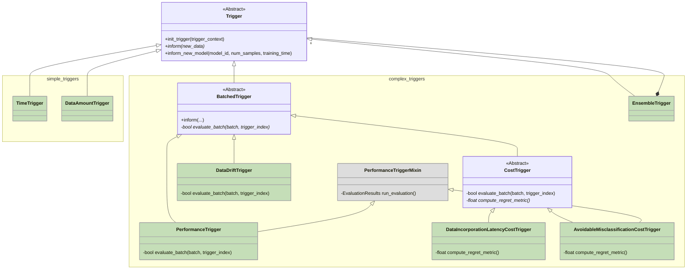

# Modyn Triggering

Alongside the simple triggers, Modyn also provides complex triggers that can be used to trigger the training of a model.

Despite the line being blurry, complex triggers are generally more sophisticated and require more information to be provided to the trigger - they most of the time cannot be pre-determined via a simple configuration entry but require
reingested information from the ongoing pipeline run.

Some complex triggers can only make decisions in batched intervals as they are cannot be efficiently computed
on a per-sample basis. Here we can find the `DataDrift` and `Cost` based triggers.

Another policy type is the `EnsemblePolicy` which can be used to combine multiple triggers into a single trigger. This can be useful if multiple triggers should be evaluated before the training of a model is triggered.
One can either use pre-defined ensemble strategies like `MajorityVote` and `AtLeastNEnsembleStrategy` or define custom functions that reduce a list of trigger decisions (one per sub-policy) and make decisions on them freely via the CustomEnsembleStrategy.

