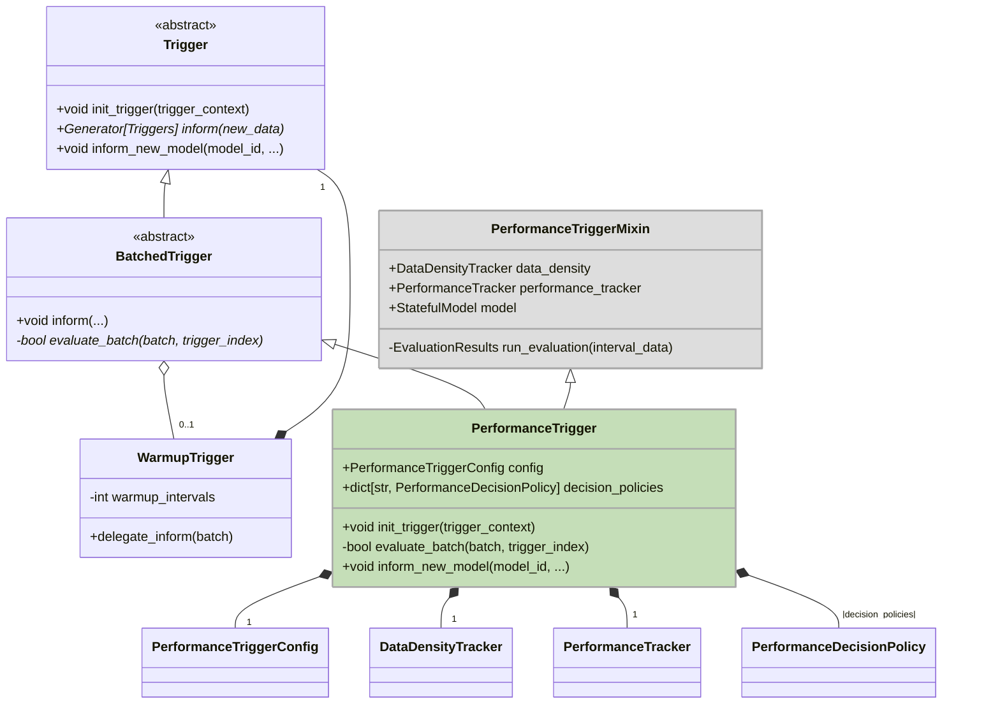
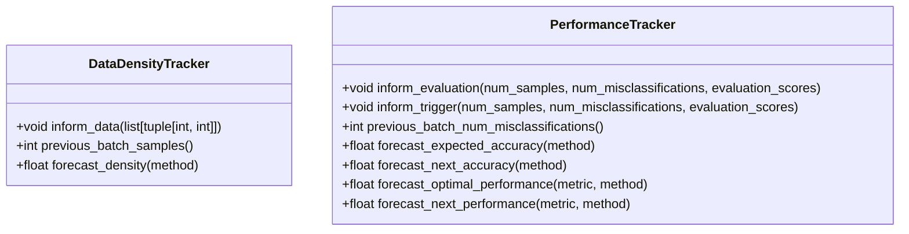
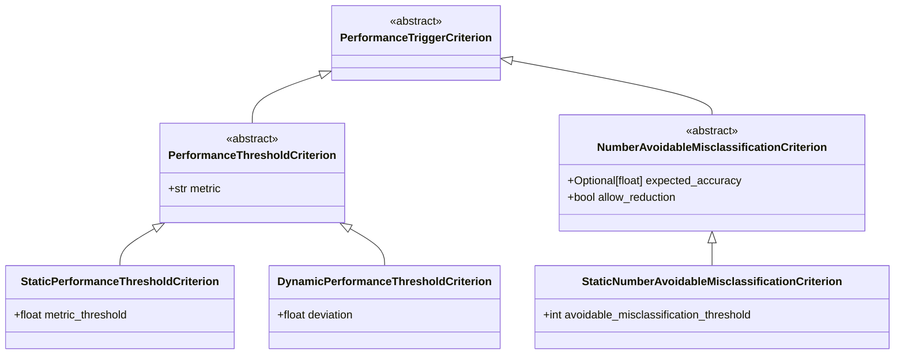
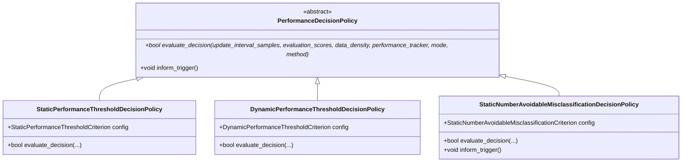

# Performance Triggering

## Overview

The `PerformanceTrigger` is a trigger mechanism that evaluates the performance of a model over time and makes decisions based on performance-observing criteria. Unlike simple triggers, the `PerformanceTrigger` considers user selected performance metrics and can evaluate decisions based on static or dynamic performance thresholds, as well as the number of avoidable misclassifications.

We define `avoidable misclassifications` as the misclassifications that could have been avoided if the model had triggered earlier. They can be seen as the lost benefits of not triggering. We derive the avoidable misclassification estimates by observing two time series:

1. The series of evaluation scores after each of the triggers. We evaluate the fresh model on the last evaluation interval. We define the performance estimates derived from these results as `expected performance`.

2. The series of evaluation SINCE the last trigger on policy update points where we could have triggered but decided not to. This series is used to estimate the avoidable misclassifications. We define those results as `actual/effective performance`.

The delta between the expected and the actual performance is then used to estimate the avoidable misclassifications.

This mechanism relies on performance tracking and data density (queries or samples per second) tracking to observe trends. In `lookahead` mode we use data density estimates to forecast how many queries/samples will arrive in the next interval as this influences the number of expected misclassifications.
Decision policies then make the binary decisions (trigger or not) based on this information.

For the performance and misclassification estimations we can always take two approaches: `hindsight` and `lookahead`. The `hindsight` approach uses the most recent data to estimate the performance and misclassifications that have already happened.

The `lookahead` approach uses the forecasted performance and misclassifications to make decisions.

### Main Architecture

### `DataDensityTracker` and `PerformanceTracker`

As mentioned, we derive triggering decisions by observing (time-) series of performance metrics and data density and forecasting future values based on past trends. The `DataDensityTracker` is responsible for tracking the density of incoming data. `PerformanceTracker` tracks the model's performance over time. It stores performance metrics after each trigger and forecasts future performance based on recent trends.

### `PerformanceTriggerCriterion` Hierarchy

The PerformanceTriggerCriterion class is an abstract configuration base class for criteria like `StaticPerformanceThresholdCriterion` and `DynamicPerformanceThresholdCriterion`, which define how decisions are made. Even if the threshold generation is somewhat different to the DecisionCriteria in the drift triggers, the concept is similar. The configuration made in those models will determine the decision process within the `PerformanceDecisionPolicy` classes.

### `PerformanceDecisionPolicy` Hierarchy

The `PerformanceDecisionPolicy` is an abstract base class that defines the decision-making process for performance triggers. It is extended by specific policies that define how decisions are made:

1. **StaticPerformanceThresholdDecisionPolicy**: Triggers when the performance metric falls below a static threshold.
2. **DynamicPerformanceThresholdDecisionPolicy**: Triggers when the performance metric deviates beyond a dynamic threshold, based on a rolling average.
3. **StaticNumberAvoidableMisclassificationDecisionPolicy**: Triggers when the number of avoidable misclassifications exceeds a predefined static threshold.

<b>What are avoidable misclassification?</b>

Avoidable misclassifications are the misclassifications that could have been avoided if the model had triggered earlier. They can be seen as the lost benefits of not triggering. Every evaluation point we estimate the avoidable misclassifications by comparing the expected performance (the performance of the model if we had triggered) with the actual performance (the performance of the model since the last trigger). Avoidable misclassifications are then derived from the difference between the expected and actual accuracy and the estimated query density. In forecasting mode the expected future avoidable misclassifications are included when comparing to the threshold.

<b>Hindsight vs. Forecasting mode</b>

All decision work on estimates of e.g. the expected performance, next actual/observed performance (if no trigger is executed now) and the estimated query density. The estimates can be made in two modes: `hindsight` and `forecasting`.

In hindsight mode, decisions are based solely on the current observed performance metrics. This mode checks if the most recent performance falls below a predefined threshold or deviates significantly from the expected performance, based on past evaluations. It is a retrospective approach, relying on already observed data to determine if a trigger should be invoked. Triggering happens post-factum when the performance has already degraded / a threshold has been crossed.

On the other hand, forecasting mode looks forward and incorporates predictions of future performance into the decision-making process. This mode not only evaluates the current performance but also forecasts future performance and data density to anticipate potential issues before they occur. For example, in the static number avoidable misclassification policy, `lookahead` mode predicts whether the cumulative number of avoidable misclassifications will exceed the threshold before the next evaluation.
We also derive the cumulated number of avoidable misclassifications like in hind-sight mode and but then add the virtual forecasted number of avoidable misclassifications. That value is then compared with the threshold instead the "past" cumulation counter only. The forecasted number of avoidable misclassifications isn't persisted in the cumulative counter, though.
By doing so, it aims to prevent performance degradation by triggering preemptively, rather than waiting for the problem to manifest.

## Remark on Use Cases

The `PerformanceTrigger` is useful in scenarios where the model's performance is expected to degrade gradually over time. For example, in a production environment where the data distribution slowly drifts, the model's accuracy may decrease over time. In such cases, after a certain time of performance degradation, the model should be retrained to maintain its accuracy.
Even if a performance threshold is not crossed, the `PerformanceTrigger` can trigger a retraining based on the number of cumulated avoidable misclassifications.
