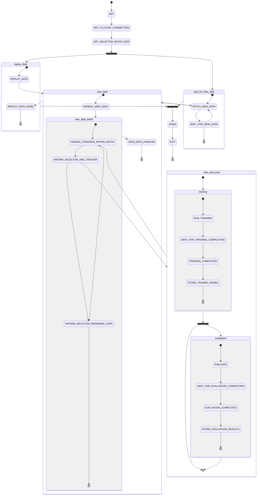

# Pipeline

## Pipeline Orchestration

### Current pipeline

- control flow not very clear
- stage dependencies are not modeled explicitly
- parallel pipeline steps are unclear
- multiple transitions to the same stage (e.g. WAIT_FOR_TRAINING_COMPLETION) while processing sequentially...

